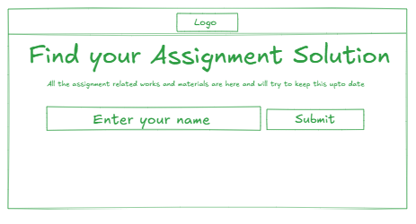
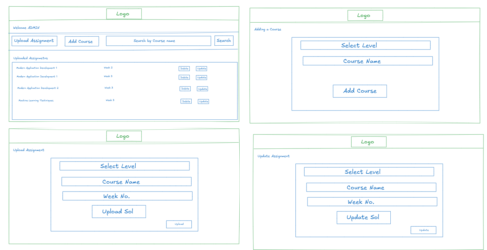
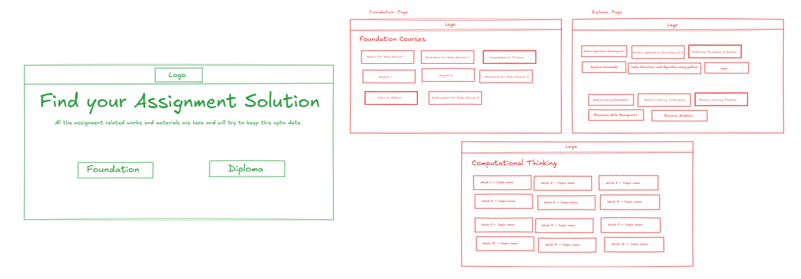

# Assignment Solution

You are required to build a Assignment solution System web application that allows Admins and user to interact with the system based on their roles.

### These are the mandatory frameworks on which the project has to be built.
- Flask for application back-end
- Jinja2 templating, HTML, CSS and Bootstraps for application front-end
- SQLite for database (No other database is permitted)

# Roles and Functionalities 
1. Admin
   - Admin is the pre-existing superuser of the application
   - Can add, update, and delete doctor profiles (name, specialization, availability).
   - Can view and manage all appointments.
   - Can search for patients or doctors by name/specialization.
2. User
    - User is also pre-existed and user of the application
    - User can go to their respective level and select a course from where it will select a week and see the solution pdf
# Key terminologies
1. Home -- A person will first visit this site then puts the name and based on the named (one for user and another for admin two person will be preexist) the site will redirect to either admin dashboard or user page.

📸 **Home Page**

2. Admin -- A superuser with the highest level of access who manages the courses,assignments solution and overall website data (He can upload assignment, can add courses, can update assignment, can delete a particular week of assignment)

📸 **Admin Dashboard**

3. User -- A pre existing user who can go to the website and only access the solutions, it will contains two option either diploma or foundation, based on the user choice it will redirect to the foundation page or diploma page.

📸 **User Dashboard**

4. Courses -- Courses or subjects which only admin can add and in that courses there will be weeks where in each week there will be solutions which the admin will uplaod

5. Level -- There will be two levels that's foundation and diploma which will be pre existing and under that level their will be many courses

# Core Features

1. Admin Functionalities 
    - Admin dashboard must display the places to upload assignment solution and a place to total number of courses and displays the uploaded assignment solutions
    - Admin should pre-exist in the app i.e. it must be created programmatically after the creation of the database. [No admin registration allowed]
    - Admin can add and delete courses
    - Admin can view all the assignments solution that's of particular course and week.
    - Admin can search for which course's which week assignments is uploaded  
    - Admin can update an assignment which is already uploaded by the update feature with only the updated pdf and nothing else.
    - Admin can delete an uploaded assignment if it wants

2. Users functionality
    - User must show the page with the option of two that is foundation or diploma
    - Based upon the decision it will either show foundation page or diploma page 
    - both the pages will contain the courses and based on choice of the course ot will show the course page
    - The course page will contain week wise options which upon on clicking will redirect to the solution pdf of that week.

## Other core functionalities 
- Prevent multiple Uploadation of the same week assignment for the same course (once uploading English 1 Week 2 solution I can't again upload another english 1 week 2 solution so for that I have update option) for the admin
- Admin should be able to search for a course by course name

## File Structure

Assignment_finder

│

├── app.py

├── models.py

├── requirements.txt

├── config.py

│

├── instance/

│ └── hms.db # SQLite is generated here automatically

│

├── static/

│ ├── css/

│ │ └── style.css # (optional) minimal custom css

│ └── images/ # (optional)

│

├── templates/

│ ├── layout.html # base layout with navbar

│ │

│ ├── home/

│ │ ├── home.html

│ │

│ ├── admin/

│ │ ├── dashboard.html

│ │ ├── add\_course.html

│ │ ├── upload\_assignment.html

│ │ ├── update\_assignment.html

│ │

│ ├── user/

│ │ ├── dashboard.html

│ │ ├── foundation.html

│ │ ├── diploma.html

│ │ └── course.html

│

└── blueprints/

├── auth.py

├── admin.py

├── user.py